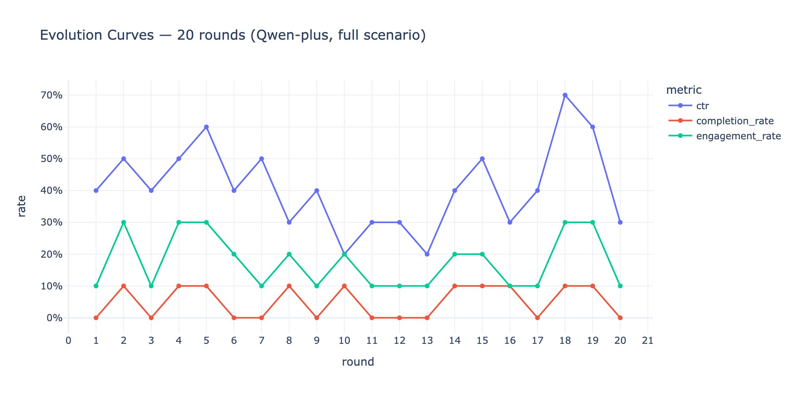
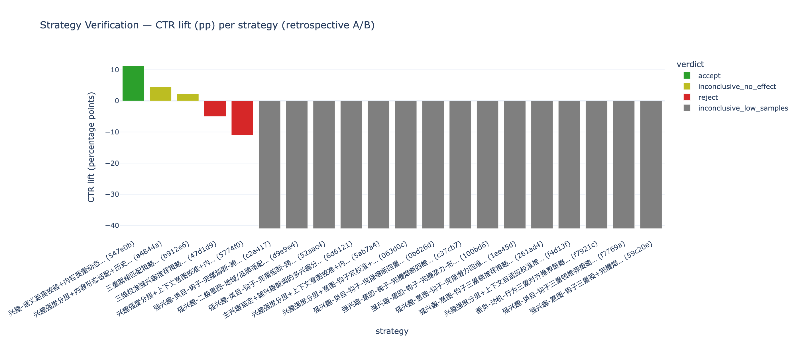
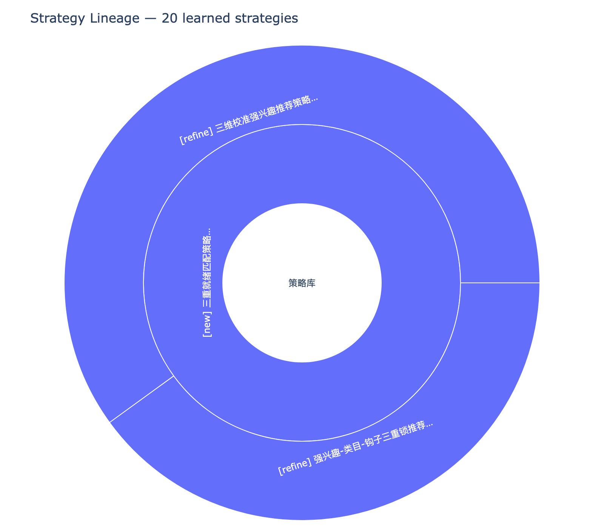

<p align="center">
  <h1 align="center">EvoAdAgent</h1>
  <p align="center">
    <em>A Self-Evolving Agent That Learns to Recommend by Doing</em>
  </p>
  <p align="center">
    <a href="#quick-start">Quick Start</a> |
    <a href="#architecture">Architecture</a> |
    <a href="#features">Features</a> |
    <a href="#usage">Usage</a> |
    <a href="#roadmap">Roadmap</a>
  </p>
  <p align="center">
    
    
    
    
  </p>
</p>

---

> **Positioning note.** EvoAdAgent is a **research-grade simulation** of an LLM-driven self-evolving recommendation agent in an ad-styled setting. It is **not** a production ad platform. Validation is offline and simulator-based. We make no claim that the system would work on live ad traffic without online A/B. This is the fundamental limit of offline evaluation and we acknowledge it explicitly in the [Limitations](#limitations) section.

---

**EvoAdAgent** is a self-evolving recommendation agent that uses LLMs to take over the **knowledge-worker parts** of ad operations -- reading briefs, executing decisions, reflecting on outcomes using [Reflexion](https://arxiv.org/abs/2303.11366), and distilling reusable strategies. Numerical-heavy parts of ad tech (bid optimization, CTR modeling, pacing) are intentionally left to traditional models -- this project is the *brain*, not the *hand*.

Each round: the agent recommends, a calibrated user simulator reacts, a reflector writes a structured post-mortem, a distiller crystallizes reflections into strategies, and FAISS indexes them for retrieval on the next round. The strategy library grows autonomously; a retrospective A/B verifier (Cohen's d) separates strategies that genuinely lifted CTR from noise.

## Features

- **Dual-Layer LangGraph Architecture** -- Outer graph orchestrates the evolution cycle; inner graph runs a ReAct tool-calling agent for recommendation decisions.
- **Reflexion-Based Self-Improvement** -- Structured post-campaign analysis inspired by *Reflexion* (NeurIPS 2023), producing actionable insights that feed strategy distillation.
- **Autonomous Strategy Distillation (NEW / REFINE / MERGE)** -- Three-mode distiller: NEW extracts novel patterns, REFINE improves existing strategies (with validated parent linkage), MERGE clusters semantically similar strategies via FAISS and abstracts them into a meta-strategy using the LLM.
- **FAISS Dual-Layer RAG** -- L2 user-profile index + L3 strategy-library index. The executor retrieves relevant strategies via semantic search and injects them into the ReAct prompt, so learned strategies actually change future behavior.
- **Probabilistic User Simulator** -- LLM estimates click/complete/like/share probabilities (what LLMs are good at); Python Bernoulli-samples with deterministic per-(user,item) RNG (what LLMs are bad at). Avoids the "LLM-says-yes-to-everything" saturation bias that naive simulators suffer from. Inspired by [RecAgent](https://arxiv.org/abs/2306.02552).
- **Retrospective A/B Verifier** -- For each learned strategy, compares campaign rounds that applied it vs didn't, computing CTR lift and Cohen's d effect size with an explicit `inconclusive_low_samples` verdict band -- the code never hides noise behind a false "accept".
- **Four-Layer Memory System** -- Campaign logs (SQLite), user-profile FAISS (L2), strategy-library FAISS + Markdown (L3), and evolution-view layer (L4) work together.
- **Multi-LLM Support** -- Separate LLM configs for executor, reflector, distiller, and simulator. Supports OpenAI, Qwen (DashScope), and DeepSeek out of the box.
- **Real Dataset** -- Built on [KuaiRec](https://kuairec.com/) (Kuaishou recommendation dataset) with Chinese captions, three-level categories, and real user demographic profiles.

## Architecture

### Dual-Layer LangGraph Design

```
                        OUTER GRAPH (Evolution Cycle)
 ┌─────────────────────────────────────────────────────────────────────┐
 │                                                                     │
 │   ┌──────────┐      ┌──────────┐      ┌──────────┐                 │
 │   │ Execute  │─────>│ Reflect  │─────>│ Distill  │────> END        │
 │   │   Node   │      │   Node   │      │   Node   │                 │
 │   └────┬─────┘      └──────────┘      └─────┬────┘                 │
 │        │            Reflexion-based          │                      │
 │        │            analysis of what         │  NEW / REFINE /      │
 │        │            worked & failed          │  MERGE strategy      │
 │        │                                     │                      │
 │   ┌────┴──────────────────┐            ┌─────┴──────────────┐      │
 │   │   INNER GRAPH         │            │  Strategy Library   │      │
 │   │   (ReAct Agent)       │            │  (Markdown + Index) │      │
 │   │                       │            └─────────────────────┘      │
 │   │  ┌───────┐  ┌──────┐ │                                         │
 │   │  │ Agent │─>│ Tool │ │  ReAct Loop                             │
 │   │  │ Node  │<─│ Node │ │  (think → act → observe → ...)          │
 │   │  └───┬───┘  └──────┘ │                                         │
 │   │      │                │                                         │
 │   │  ┌───┴─────┐         │                                         │
 │   │  │ Extract │──> END  │                                         │
 │   │  │  Node   │         │                                         │
 │   │  └─────────┘         │                                         │
 │   └──────────────────────┘                                         │
 │                                                                     │
 └─────────────────────────────────────────────────────────────────────┘
```

### Core Evolution Loop

```
 ┌───────────────────────────────────────────────────────────────────┐
 │                                                                   │
 │  ┌─────────┐   ┌──────────┐   ┌─────────┐   ┌─────────┐        │
 │  │ Execute │──>│ Simulate │──>│ Reflect │──>│ Distill │         │
 │  │  (ReAct │   │  (LLM    │   │ (Verbal │   │ (NEW /  │         │
 │  │  Agent) │   │  Users)  │   │  RL)    │   │ REFINE) │         │
 │  └─────────┘   └──────────┘   └─────────┘   └────┬────┘         │
 │       ^                                           │               │
 │       │         ┌──────────────────┐               │               │
 │       └─────────│ Strategy Library │<──────────────┘               │
 │                 │ (grows each      │                               │
 │                 │  round)          │                               │
 │                 └──────────────────┘                               │
 │                                                                   │
 └───────────────────────────────────────────────────────────────────┘
```

### Four-Layer Memory System

| Layer | Name | Storage | Purpose |
|-------|------|---------|---------|
| L1 | Campaign Log | SQLite | Full decision traces, metrics per round |
| L2 | User Profiles | FAISS (Qwen `text-embedding-v2`, 1536d) | Semantic nearest-neighbor retrieval over user personas; reachable from ReAct via the `find_similar_users` tool |
| L3 | Strategy Library | Markdown + FAISS vector index | Keyword and semantic search over distilled strategies |
| L4 | Evolution Log | View layer over L1+L3 | Evolution curves, strategy lineage, usage counts |

### Ad Tools (Inner ReAct Agent)

| Tool | Module | Description |
|------|--------|-------------|
| `analyze_audience` | `audience_analyzer.py` | Analyze user group demographics (gender, age, region, interests) |
| `analyze_content_pool` | `audience_analyzer.py` | Analyze content distribution by category and tags |
| `match_user_content` | `targeting.py` | Score and rank content for a specific user based on interest overlap |
| `generate_recommendation` | `targeting.py` | Produce a final user-content recommendation with reasoning |
| `load_strategy` | `creative_generator.py` | Load a distilled strategy into the agent's decision process |
| `set_bid_strategy` | `bidding.py` | Compute a bid priority score from audience size + competition + mode |
| `evaluate_performance` | `performance.py` | Compute CTR / completion rate / engagement rate + composite score |
| `find_similar_users` | `user_retrieval.py` | Query the L2 FAISS index for users with semantically similar personas -- this is how the ReAct agent actually consumes L2 memory during cold-start or unfamiliar-user reasoning |

## Quick Start

### Prerequisites

- Python 3.10+
- An API key for OpenAI, Qwen (DashScope), or DeepSeek

### Installation

```bash
git clone https://github.com/leeleelxl/EvoAdAgent.git
cd EvoAdAgent
pip install -e .
# optional: for Streamlit evolution dashboard
pip install -e ".[viz]"
```

### Run

```bash
# Using OpenAI
OPENAI_API_KEY=sk-xxx python -m examples.demo_evolution --rounds 5

# Using Qwen (DashScope)
DASHSCOPE_API_KEY=sk-xxx python -m examples.demo_evolution --rounds 5 --provider qwen

# Using DeepSeek
DEEPSEEK_API_KEY=sk-xxx python -m examples.demo_evolution --rounds 5 --provider deepseek
```

## Usage

### Basic Evolution Run

```bash
python -m examples.demo_evolution \
    --rounds 10 \
    --provider qwen \
    --model qwen-plus \
    --users 15 \
    --scenario 宠物
```

**Parameters:**

| Arg | Default | Description |
|-----|---------|-------------|
| `--rounds` | 5 | Number of evolution rounds |
| `--provider` | openai | LLM provider (`openai` / `qwen` / `deepseek`) |
| `--model` | gpt-4o-mini | Model name (auto-mapped per provider) |
| `--users` | 10 | Number of users sampled per round |
| `--scenario` | (all) | Scenario filter (e.g., `宠物`, `美食`) |

### Programmatic Usage

```python
from src.agent.evo_ad_agent import EvoAdAgent
from src.config import LLMConfig, ProjectConfig
from src.simulation.scenarios import create_full_scenario

config = ProjectConfig(
    executor_llm=LLMConfig(provider="qwen", model="qwen-plus"),
    reflector_llm=LLMConfig(provider="qwen", model="qwen-plus"),
    distiller_llm=LLMConfig(provider="qwen", model="qwen-plus"),
    simulator_llm=LLMConfig(provider="qwen", model="qwen-plus"),
)

agent = EvoAdAgent(config)
users, contents = create_full_scenario()
agent.setup_environment(users, contents)
agent.run_evolution(rounds=10, scenario="宠物", n_users=15)
```

### Example Output (real 20-round Qwen-plus run)

```
============================================================
  EvoAdAgent Evolution -- 20 rounds
  Scenario: full
  L2 User Profile FAISS index: 20 users
  L3 Strategy FAISS index: configured (empty)
============================================================

--- Round 1/20 ---
  CTR: 40.00%   Completion: 0.00%   Engagement: 10.00%
  Applied strategies: (none -- cold start)
  NEW STRATEGY: strat_c047d1d9

--- Round 18/20 ---
  CTR: 70.00%   Completion: 10.00%   Engagement: 30.00%
  Applied strategies: ['strat_02547e0b', 'strat_c047d1d9', 'strat_815774f0']
  Insight: 高CTR（70%）源于强兴趣标签与垂类内容的精准三级匹配...
  NEW STRATEGY: 兴趣强度分层+内容形态适配+历史行为验证三重校准推荐策略

============================================================
  Benchmark Summary
  Elapsed: 67.2 min
  CTR: first=40% → last=30% (peak 70% at round 18)
  Strategies learned: 20
  Verdict distribution: accept=1 / reject=2 / inconclusive=17
  Output: benchmark_results/run_20260413_141837.json
============================================================
```

## Benchmark Results

Real 20-round run against `qwen-plus` (67 min, ~400 LLM calls). Data exported to `benchmark_results/run_20260413_141837.json`; figures rendered via `examples/render_viz_pngs.py`.

### Evolution curves



CTR peaks at **70% in round 18** when the agent applies a three-strategy combo it learned earlier. It dips to 20% in rounds 10 and 13. The trajectory is **non-monotonic** -- honest signal that self-evolution doesn't mean every round is better; it means the agent explores, fails, and occasionally finds real wins.

### Strategy verification



Of **20 learned strategies**, the retrospective A/B verifier classified:

| Verdict | Count | Interpretation |
|---|---|---|
| ✅ `accept` | 1 | CTR lift +11.25 pp, Cohen's d = 0.74 (medium-large effect) -- strategy **"兴趣-语义距离校验+内容质量动态熔断"** |
| ❌ `reject` | 2 | Strategies that **actively hurt** CTR (-5 pp and -11 pp) |
| ⚠️ `inconclusive_no_effect` | 2 | Directional signal but below threshold |
| 🕳️ `inconclusive_low_samples` | 15 | Never retrieved by FAISS top-k -- dormant strategies |

**This is the key takeaway.** Not every "learned" strategy provides real lift. The verifier's job is to separate signal from noise -- raw distillation produces ~5% actionable strategies, and the system can identify which is which.

### Strategy lineage



Sunburst view of the 20 strategies with REFINE/MERGE parent-child links. Most are standalone NEW strategies; a few REFINE branches show the distiller building on previous attempts.

### Reproducing the benchmark

```bash
python -m examples.benchmark_run --rounds 20 --users 10 --provider qwen --model qwen-plus
python -m examples.render_viz_pngs
# Or interactive viz:
streamlit run examples/viz_evolution.py
```

## Project Structure

```
EvoAdAgent/
├── src/
│   ├── agent/                      # Core agent modules
│   │   ├── executor.py                 # LangGraph ReAct executor (inner graph)
│   │   ├── reflector.py                # Reflexion-based reflector
│   │   ├── distiller.py                # Strategy distiller (NEW/REFINE/MERGE, REFINE parent validation)
│   │   ├── verifier.py                 # Retrospective A/B with Cohen's d (accept/reject/inconclusive)
│   │   └── evo_ad_agent.py             # Main evolution loop (outer graph)
│   ├── memory/                     # Four-layer memory system
│   │   ├── campaign_log.py             # L1: SQLite campaign log
│   │   ├── user_profile.py             # L2: FAISS user-persona index
│   │   ├── strategy_lib.py             # L3: Strategy library (Markdown + FAISS)
│   │   └── evolution_log.py            # L4: Evolution view (curves, lineage)
│   ├── simulation/                 # LLM-based simulation environment
│   │   ├── ad_environment.py           # Environment wrapper
│   │   ├── user_simulator.py           # Probabilistic simulator (LLM probs + Python Bernoulli)
│   │   └── scenarios.py                # Pre-built scenarios (pet, food, full)
│   ├── tools/                      # Ad-specific LangChain tools (7 tools, 5 modules)
│   │   ├── audience_analyzer.py        # analyze_audience + analyze_content_pool
│   │   ├── targeting.py                # match_user_content + generate_recommendation
│   │   ├── creative_generator.py       # load_strategy
│   │   ├── bidding.py                  # set_bid_strategy
│   │   └── performance.py              # evaluate_performance
│   ├── data/kuairec_loader.py      # KuaiRec CSV loader (7176 users + 9377 videos)
│   ├── config.py                   # Multi-LLM + embedding configuration
│   ├── llm_factory.py              # create_llm + create_embeddings factories
│   └── models.py                   # Dataclass data models
├── examples/
│   ├── demo_evolution.py           # CLI demo with --clean + --verify flags
│   ├── demo_merge.py               # Real-API MERGE smoke test
│   ├── benchmark_run.py            # 20-round benchmark with JSON export
│   ├── viz_evolution.py            # Streamlit evolution dashboard
│   └── render_viz_pngs.py          # Export PNG charts for README
├── tests/                          # 178 tests, all pass
│   ├── test_distiller.py               # MERGE clustering + REFINE validation
│   ├── test_verifier.py                # Cohen's d + verdicts
│   ├── test_user_profile.py            # FAISS L2
│   ├── test_user_simulator.py          # Probabilistic sampling calibration
│   ├── test_evolution_log.py           # Curve + lineage views
│   └── ...
├── benchmark_results/              # Generated JSON runs (gitignored)
├── docs/images/                    # Committed PNG figures
└── pyproject.toml
```

## Tech Stack

| Component | Technology |
|-----------|-----------|
| Agent Framework | [LangGraph](https://github.com/langchain-ai/langgraph) (StateGraph + ToolNode) |
| LLM Integration | [LangChain](https://github.com/langchain-ai/langchain) (ChatOpenAI, multi-provider) |
| Vector Store | [FAISS](https://github.com/facebookresearch/faiss) (user profile embeddings) |
| API Layer | [FastAPI](https://fastapi.tiangolo.com/) |
| Database | SQLite (campaign logs) |
| Data Processing | Pandas, NumPy |
| LLM Providers | OpenAI, Qwen (DashScope), DeepSeek |

## Dataset

This project uses [KuaiRec](https://kuairec.com/), a real-world recommendation dataset from Kuaishou (Chinese short-video platform), featuring:

- **User profiles** with demographics (gender, age, region, device, activity level)
- **Video items** with Chinese captions, topic tags, and three-level hierarchical categories
- **Interaction logs** for grounding the simulation

## Related Work & Differentiation

Open-source projects in the "LLM agent × advertising" intersection are **scarce**. The closest neighbors and how we differ:

| Project | Focus | What They Have | What We Add |
|---|---|---|---|
| [RTBAgent](https://github.com/CaiLeng/RTBAgent) (WWW 2025) | Real-time bidding | Daily reflection, CTR model integration, iPinYou dataset | Strategy self-evolution (NEW/REFINE/MERGE), Verifier with Cohen's d, FAISS L2+L3 memory |
| [BannerAgency](https://github.com/sony/BannerAgency) (EMNLP 2025, Sony) | Banner creative generation | Multimodal LLM agents, BannerRequest400 benchmark | Orthogonal -- we focus on strategy layer, not creatives |
| [LBM](https://github.com/yewen99/LBM-WWW26) (WWW 2026) | Auto-bidding | Hierarchical dual-embedding model, GQPO offline RL | Orthogonal -- we do strategy reasoning via LLM agent, not bidding optimization |

**Positioning**: RTBAgent and LBM target the **bidding** layer; BannerAgency targets the **creative** layer. EvoAdAgent is the only open project we are aware of that targets the **strategy self-evolution** layer (generate → execute → reflect → distill → verify), with explicit quantitative lift attribution via the Verifier.

### Academic References

| Paper | Venue | How It's Used |
|-------|-------|---------------|
| [Reflexion: Language Agents with Verbal Reinforcement Learning](https://arxiv.org/abs/2303.11366) | NeurIPS 2023 | Core reflection mechanism -- the agent verbally analyzes what worked and what failed after each round |
| [RecAgent: A Novel Simulation Paradigm](https://arxiv.org/abs/2306.02552) | TOIS 2025 | Inspires the LLM-based user-behavior simulation with persona-grounded responses |
| [InteRecAgent: Recommender Agent with LLM Tools](https://arxiv.org/abs/2308.16505) | TOIS 2025 | Inspires the tool-augmented recommendation approach and offline evaluation protocol |
| [RTBAgent](https://arxiv.org/abs/2502.00792) | WWW 2025 | Closest open peer; their "daily reflection" informs our Reflector design |
| [KuaiRec: A Fully-observed Dataset](https://arxiv.org/abs/2202.10842) | CIKM 2022 | Source of the user personas, video captions, and (planned) interaction-level ground truth |
| [AgentRecBench](https://arxiv.org/abs/2505.19623) | NeurIPS 2025 | Offline-evaluation protocol reference for the planned real-data validator |

## Limitations

We take honest accounting of what this project does **not** prove seriously. Offline simulation-based evaluation has fundamental limits, and we list them here rather than hoping readers don't ask.

1. **No real click logs.** The CTR numbers in the benchmarks come from an LLM-based user simulator, not real users responding to real ads. The simulator is designed with a probabilistic sampling layer to avoid "LLM-says-yes-to-everything" saturation, but it is still an approximation of human behavior.
2. **No online A/B.** We make no claim that strategies learned in this system would transfer to live ad platforms. That requires real traffic, real advertisers, real budgets, and counterfactual setup -- all outside project scope.
3. **No causal / OPE guarantees.** Because KuaiRec's `small_matrix` is fully-observed, we *can* sidestep selection-bias issues that plague MovieLens-style datasets, but we do **not** apply Inverse Propensity Scoring or Doubly Robust OPE. Our Verifier reports descriptive statistics (CTR lift, Cohen's d) not causal effects.
4. **Not a production ad platform.** We intentionally do not model: bid pacing, budget constraints, creative fatigue, lookalike expansion, fraud detection, advertiser quality scores, or auction dynamics. These are all the "hand" parts of ad tech; this project is about the "brain" -- strategy reasoning done by LLMs.
5. **Small scale.** 20 users / 16 content items / 20 rounds is an experimental setup, not industrial scale. Core claims are about *framework behavior*, not *production performance*.
6. **Strategies may rediscover folk wisdom.** Many strategies the distiller produces ("first 3 seconds need emotional hook", "match interests before demographics") are well-known in the creative industry. The novelty is in the *autonomous extraction and verification* pipeline, not in the strategies themselves.
7. **Validation plan is a work-in-progress.** The `Tier 1` simulator-fidelity calibration (Spearman ρ against KuaiRec watch_ratio) and `Tier 2` Evo-Agent vs Vanilla-Agent ablation with paired bootstrap are roadmap items, not completed experiments.

**This project is best understood as:** a *complete reference implementation* of the Reflexion + Self-Evolution + RAG pattern applied to a recommendation scenario, with deliberate honesty about which claims are supported by current evidence.

## Roadmap

### Week 1 -- Core Framework [DONE]
- [x] Dual-layer LangGraph architecture (inner ReAct + outer evolution)
- [x] 7 ad-specific tools across 5 modules
- [x] Reflexion-based reflector with structured output
- [x] Strategy distiller with NEW / REFINE / MERGE modes
- [x] LLM user-behavior simulator (probabilistic, deterministic RNG)
- [x] SQLite campaign log (L1 memory)
- [x] Markdown strategy library (L3 memory)
- [x] Multi-LLM support (OpenAI / Qwen / DeepSeek)
- [x] KuaiRec data integration with scenario builders
- [x] CLI demo with configurable rounds and providers

### Week 2 -- Evaluation & Verification [DONE]
- [x] Retrospective A/B strategy verifier with Cohen's d
- [x] CTR / completion / engagement lift attribution per strategy
- [x] MERGE mode for strategy consolidation (semantic clustering + LLM abstraction)
- [x] REFINE parent-id validation (orphans demoted to NEW)
- [x] Probabilistic simulator fix (LLM probs + Python Bernoulli)
- [x] `--verify` and `--clean` flags on demo CLI

### Week 3 -- Memory, Retrieval, Visualization [DONE]
- [x] L2 User Profile FAISS index (Qwen `text-embedding-v2`)
- [x] L2 reachable from ReAct via `find_similar_users` tool (closes the RAG loop for user personas)
- [x] L4 Evolution Log view layer (curves, lineage, usage counts)
- [x] Strategy retrieval by scenario similarity (L3 semantic search, wired into Executor)
- [x] 20-round benchmark script with JSON export
- [x] Streamlit dashboard + PNG export for README
- [x] Honest positioning + Limitations section in README

### Week 4 -- Production & Real-data Validation [PLANNED]
- [ ] Real-data validator on KuaiRec `small_matrix` (fully-observed, 1411 users × 3327 videos)
- [ ] Standard offline metrics: NDCG@10 / Recall@10 / Hit@10
- [ ] 5-baseline comparison: Random / Popularity / ItemCF / Vanilla-Agent / Evo-Agent
- [ ] Paired bootstrap + McNemar test for significance
- [ ] FastAPI serving endpoint
- [ ] `eval/metrics.py` unified metrics module

## License

This project is licensed under the [MIT License](LICENSE).

---

<p align="center">
  <sub>Built with LangGraph, powered by Reflexion.</sub>
</p>
